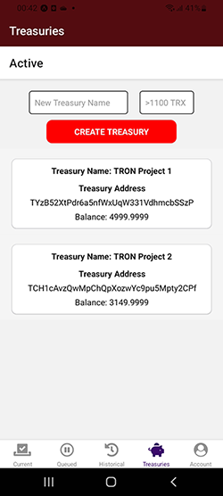
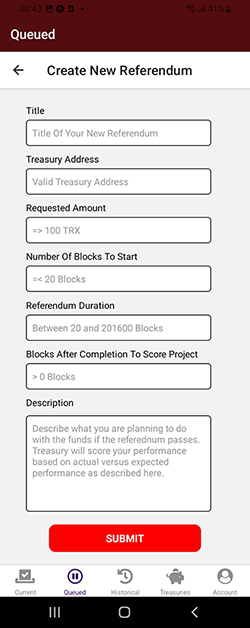
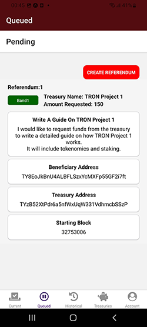
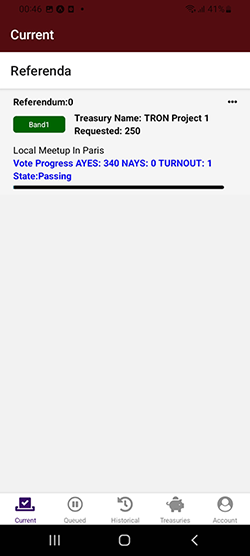
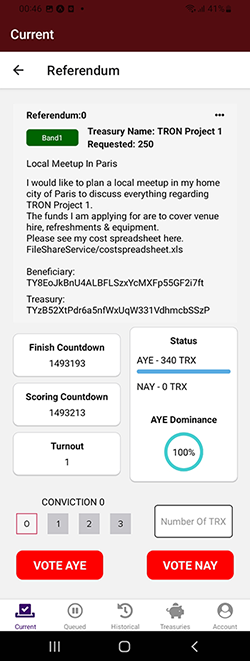
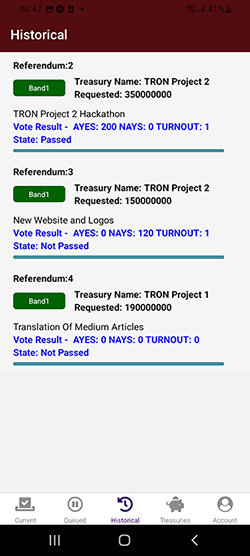
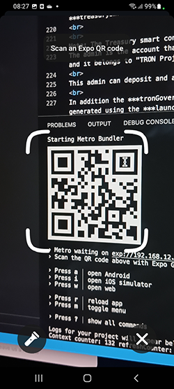
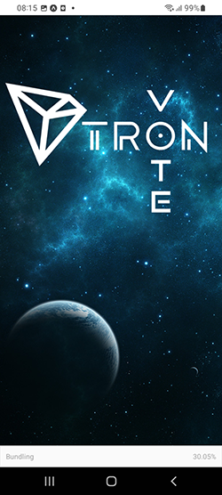

## Submission for Tron Hackathon Season 3.
<br>

# **TronVote**

## Demo Video & APK

---

<p> A demo video of the mobile DApp can be found <a href="" target="_blank">here.</a>
</p>

<p> An APK of the mobile Dapp for side loading on Android devices can be found <a href="https://expo.dev/accounts/bracjy/projects/trongov/builds/3840fcb3-4afe-4e05-b7aa-b871821cca10" target="_blank">here.</a>
</p>
<br>

# Project description


For the Tron ecosystem to reach its full potential, a global democatic Treasury service is needed to allow projects to outsource their growth to their communities.

The TRONVOTE project aims to offer the ability to any Tron Deployed project to create and manage a treasury account and use it to fund any applicants (beneficiaries) that ask for funding to carry out any task or process with the aim of promoting the project ecosystem.

For Example:
<br>
Assume we have "TRON Project 1" and that Alice is an enthusiast and follower of this project.
Alice believes she can get involved to help promote "TRON Project1".
Here are some examples of how Alice might help:
<br>

- Organise a physical conference with live broadcasting
- Arrange a local meetup
- Run a Twitter / Reddit campaign
- Organise a hackathon
- Create Promotional or Educational Videos
- Write and Publish Medium articles
- Write documentation on “How to do” a task on the project
- Write additional external code for the project (dashboards / analytics / mobile apps
- Create logos and promotional material

<br>
<p>

# Basic Overview
To begin with, "TRON Project 1" uses the TRONVOTE DApp to setup and fund their own Treasury account.
<p>
<p>
Alice decides she wants to organise her own local meetup for enthusiasts of "Tron Project 1" so she also accesses the TRONVOTE DApp and creates a referendum to allow her proposal to be voted on by the other project users. Within her referendum she explains what she wants to do and the funds that she is applying for to complete the task from the "TRON Project 1" Treasury. 
<p>
<p>
The community then votes on Alice's referendum and if successful at the end of the voting period, the funds are automatically transferred from the "TRON Project1" Treasury account to Alice's account.
<p>
<p>
After the completion of Alice's event, the community have the opportunity of scoring Alice's performance and this will effect the amount of funds that Alice can apply for from the Treasury account next time either in a positive or negative way. 

Alice can build up a strong reputation within the community, with a proven track history of sucessful funding.

"TRON Project 1" expands its community involvment exponentially.

<br>
<p>

# Detailed Overview

The critical parts of the project are:
<br>

## The Treasury Account.

The ability for any project, (e.g. TRON Project 1) to create a treasury account with a minimum funding. 
<br>
The project always has the ability to deposit or withdraw funds but to be an eligible treasury account it must always maintain a certain minimum balance.
<br>

<br>

## Beneficiaries and Referendum

Anyone can create a Referendum and apply for a certain amount of TRX tokens from a project Treasury account for a certain task which is described in detail and stored in an ***IPFS file***.
<br>

When a beneficiary creates a new refendum they pass certain information such as:

- The Treasury address they are requesting funding from
- The amount of TRX requested 
- In how many blcoks the refrendum should start
- The duration of the refeendum
- The number of blocks following the refendum that the beneficiaries work can then be scored

This information is stored within IPFS and retrieved when needed in other parts of the DApp.

Ideally the decription of what task the beneficiary will be performing will incude a breakdown of the expenses expected to be inccurred that require funding.
<br>
Failing to provide analytical information, allowing too short duration for the refrendum to be thoroughly studied by the community and then votted on, too distant a period for scorring block number arrangement, will affect the mood of the community in favor or against the referendum and therefore the concluding passing / not passing result.
<br>



<br>

## Voting

Any account can vote once only for any referendum expressing whether it is in favor (AYE) or against (NAY) the proposed referendum.
<br>
A voter can express their vote by transfering any amount of TRX currency together with a conviction number.
<br>
The conviction number is a way to multiply the "weight" of your vote, by locking up your voting tokens for a longer period of time.

The conviction number starts at 0 (indicating no multiplier and no lock up period) and can be as high as 3 (indicating a multipler of 4 and lock up period of 30 blocks) after the conclusion of the referendum.
<br>



> Note: An example of the multiplier.
> <br>
> If a voter has transfered 100 TRX coins with convition 0 and a direction of "Nay" this carries a weight of 100, whereas if another voter has transferred 100 TRX coins with conviction 3 and a direction of "Aye" then this voting weight is 4*100 = 400 and since 400 > 100 this results in the referndum passing.

 <br>

## Beneficiary Scoring

Any request for funding should be rewarded or punished depending on the quality of the work carried out versus the expectations. This also creates traction, loyalty and continuous growth.
<br>
For this reason when a referendum is created by a beneficiary, a scoring date (in the form of blocks after the referendum has passed) is also passed to the smart contract. Although dictated by the beneficiary asking for funding to perform the task, it should reflect the time in future (future block number) that the beneficiary expects that their work will be completed and ready for judging.
<br>

At that future block number the Treasury account which funded the beneficiary can invoke a certain function to score the beneficiary for their work from 0 to 100 with 0 being poor and 100 very satisfactory. This scoring can be further enanced as an extension of the project to governance where the treasury account is controlled by a community DAO.
<br>

The average scoring of a beneficiary indicates how their work is rated across any past sucessful referendums and is stored in the smart contract.
<br>
When a beneficiary’s score crosses certain scoring band thresholds, then higher amounts of funding are unlocked allowing a beneficiary to be trusted with larger project funding requests.
<br>

The smart contract preserves a score rating (0 to 100 with 100 being best) for each applicant / beneficiary. Eveyone starts at 25 and this score permits the applicant to ask for funding in TRX tokens up to a certain band.
<br>

>Note: There can be further additions to the project such as instigating a cool off period for an applicant or reducing their scoring for referendums they submitted and were not passed to motivate and promote good actors.

<br>

## Historical Referenda

All historical referenda data can be viewed on the DApp.
<br>


<br>

## CONCLUSION

It is now easy for any Project to 
- Create and manage a Treasury Account
- Allow skillful applicants and enthusiasts to make Treasury fund requests to promote the project
<br>

Bringing projects together with their communities will allow the Tron ecoystem to expand even faster.


<br>

## Installation

---

Installations that also allow development:

```bash
$ brew install node
$ npm install -g expo-cli
```

Install Expo Go Mobile App

* <a href="https://play.google.com/store/apps/details?id=host.exp.exponent&hl=en&gl=US&pli=1" target="_blank">Expo Go - Google Play Store Link</a>
* <a href="https://apps.apple.com/us/app/expo-go/id982107779" target="_blank">Expo Go - App Store Link</a>

Create a new folder and inside it:

```bash
$ git clone https://github.com/RyleyK9/MobileTronGov
$ npm install
$ expo start
$ QR code is produced in the terminal
```

## Mobile Dapp inside Expo Go Devleopment environment

---

<p>

STEP 1 - Open the Expo Go App on your mobile phone.
<br>
STEP 2 - Scan QR code shown in the temrminal (use Expo Go or Camera to scan QR code).
<br>
STEP 3 - The TronVote splash screen loads. 
<br>
STEP 4 - The App opens on the page displaying the current list of active referenda. 
<br>




<br>

## Technical User Journey

Lets now have an example run through for the main smart contract __tronGovernance__ together with the Mobile Dapp.
<p>

1. Project ABC calls smart contract ***launchNewTreasury*** function while trasnferring at least ***treasurerBalanceThreshold*** TRX coins (1100 TRX) by clicking SUBMIT button in the Treasuries screen of the bottom menu.
<br>
A new smart contract of ***treasury.sol*** is created, and its address is stored in the main smart contract in the treasurers array, with a list of eligible treasury accounts from which beneficiaries can apply for funding.
<br>
Furthermore the TRX balance minus the 100 sun fee for the main smart contract is passed to the newly created ***treasurysmart*** contract.
<br>
<br>
Note: The Treasury smart contract has 2 administrators.
The admin is the account that called the ***launchNewTreasury*** function and funded the treasury smart contract and it belongs to "TRON Project 1". 
<br>
This admin can deposit and also withdraw all funding from the treasusy smart contract Project ABC now owns.
<br>
In addition the ***tronGovernace*** smart contract is the govAdmin of all treasury smart contracts being generated using the ***launchNewTreasury*** function. This permits the tronGovernace smart contract to call the ***sendTransfer*** function of the treasury address of a sucessfully passed referendum in order to transfer the requested TRX coins to the referendum beneficiary.

2. Alice creates a new referendum passing the following information:

   a) The ***treasuryAddress*** of the TRON Project 1 Treasury smart contract that she wants to request funding from for performing certain tasks to promote the project.
   
   b) Amount of TRX tokens she believes is required to perform the task.
   
   c) ***IPFS CID*** that shows in greater details what the task is for e.g. for organising a local meetup of fellow project enthusiasts to discuss the latest technologies.
   
   d) 10 for ***startInNumBlocks*** dictating that the refendum should start in 10 blocks from submission allowing her enough time to inform the community that the referendum is about to start.
   
   e) ***duration*** as 100 blocks (can be up to 201600 blocks) specifying the duration of the referendum.
   
   f) ***scoreInNumBlocks*** as 200 blocks, to be added to the expiration block number of the refendum and matching the point in time when her work is concluded and the respective Treasury address of Project ABC can score her work, thereby increasing or decreasing her average score, affecting her future ability to raise funding from any of the eligible Treasury smart contracts.

3. The functions of ***updateQueuePreparRefBlocks***, ***updateQueueActiveRefBlocks*** are used by the server to monitor whether the chain block number has approached the block number of any of the referenda that either are in the prepartion phase to be activated or are about to expire.
<br>
   As soon as it is determined that the current chain block number satisfies any of the above conditions the energy costing functions ***updatePreparedReferenda*** and ***updateActiveReferenda*** are called resulting in pushing the prepared referendums to become  active referendums and active but now finished refrendums to expired referenda and therefore available for historical retrieval on the history screen.
   Part of the functionality of ***updateActiveReferenda*** function is to judge whether a now expired refendum has passed or not by comparing the Ayes vs Nays amounts and in case it is passed, trigger the relevant treasury smart contract to transfer the requested amount of TRX coins to the respective referendum beneficiary.

4. Referendum participants can vote by calling the ***voteReferendum*** function transferring TRX coins and indicating the RefrendumID they want to vote for, together with the direction of their vote e.g. Aye or Nay and their conviction (which as explained further up entails a vote weight multipler but also possibly a lock period for the voter’s transferred TRX coins).
<br>
   Any account can only vote once per ReferednumID

5. The server is responsible in calling ***unlockVoteTokens*** to unlock amount of TRX coins for each Voter for any relevant referendum.

6. A voter can call at any time the ***withdrawVoteTokens*** to withdraw all unlocked TRX coins from historical refrenda they have participated in.

7. When the time for scoring is due, the admin of a treasury smart contract can call the ***scoreBeneficiary*** function stating the treasuryAddress (of which they must be admin of), the referendum Index they are scoring for and the actual score for the beneficiary.
   Knowing the referendum index, the smart contract can locate the referendum beneficiary address, retrieve its historical score and update the new beneficiary address average score.
